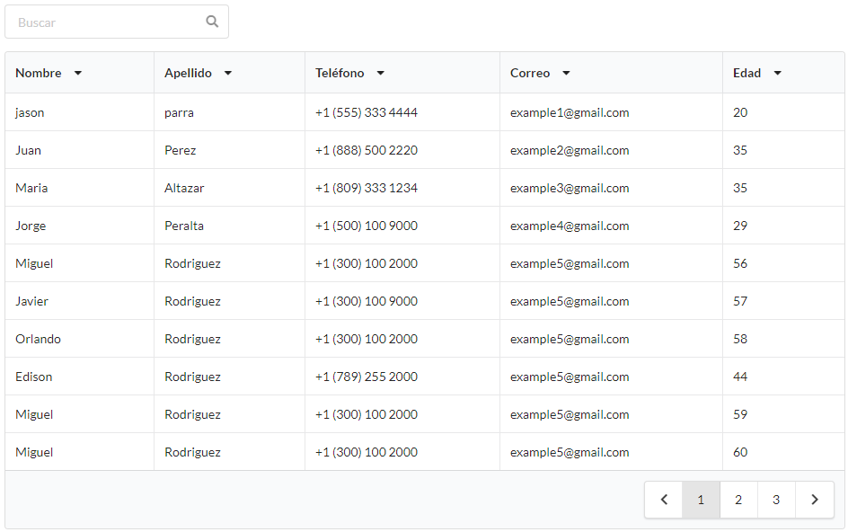

# React Table Semantic UI

## Getting Started

React Component example of semantic-ui table featuring sorting, page footer and global search bar.

### Features

1. Search bar
1. Column sorting
1. Page footer

### Example Demo

1. [Netlify] (https://naughty-edison-ff64c1.netlify.app/)
2. [Heroku] (https://sleepy-wave-02762.herokuapp.com/)

### Prerequisites

```
nodejs
```

### Installing

```
npn install
```

### Running

```
npm run dev
```

### Simple Example Usage

```
<CustomTable
	data={[
	{
	  name: "jason",
		lastName: "parra",
		phone: "+1 (555) 333 4444",
		email: "example1@gmail.com",
		age: "20",
	},
	{
		name: "Juan",
		lastName: "Perez",
		phone: "+1 (888) 500 2220",
		email: "example2@gmail.com",
		age: "35",
	},
	]}
	headers={["Nombre", "Apellido", "Teléfono", "Correo", "Edad"]}
	labels={["name", "lastName", "phone", "email", "age"]}
	searchQuery={search} //Optional
	pageRows={10}        //Optional, 10 by default
	footerPages={10}     //Optional, 10 by default
/>
```

### Screenshots


